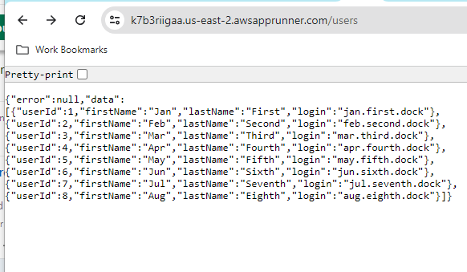

# spring-boot-service
Sample implementation of a simple Spring Boot service

The project can be run
1. Locally from an IDE
2. As a Docker container (MySQL instance included)
3. As AWS service new image is built and deployed on "push" to the "main" branch

Currently, the service is deployed at AWS, try it here:
https://k7b3riigaa.us-east-2.awsapprunner.com/users

**Note**: the spring-boot-service AWS App Runner may be stopped on occasion to save operational costs.
Please contact me directly for the local, Docker, or in-cloud demo.

Snapshot of server response:

It has both HAL Explorer (https://k7b3riigaa.us-east-2.awsapprunner.com/explorer/index.html#uri=/)
and Swagger (https://k7b3riigaa.us-east-2.awsapprunner.com/swagger-ui/index.html) connected.

A simple React application ([react-app](https://github.com/boroda123/react-app)) can be used as UI to drive this service.